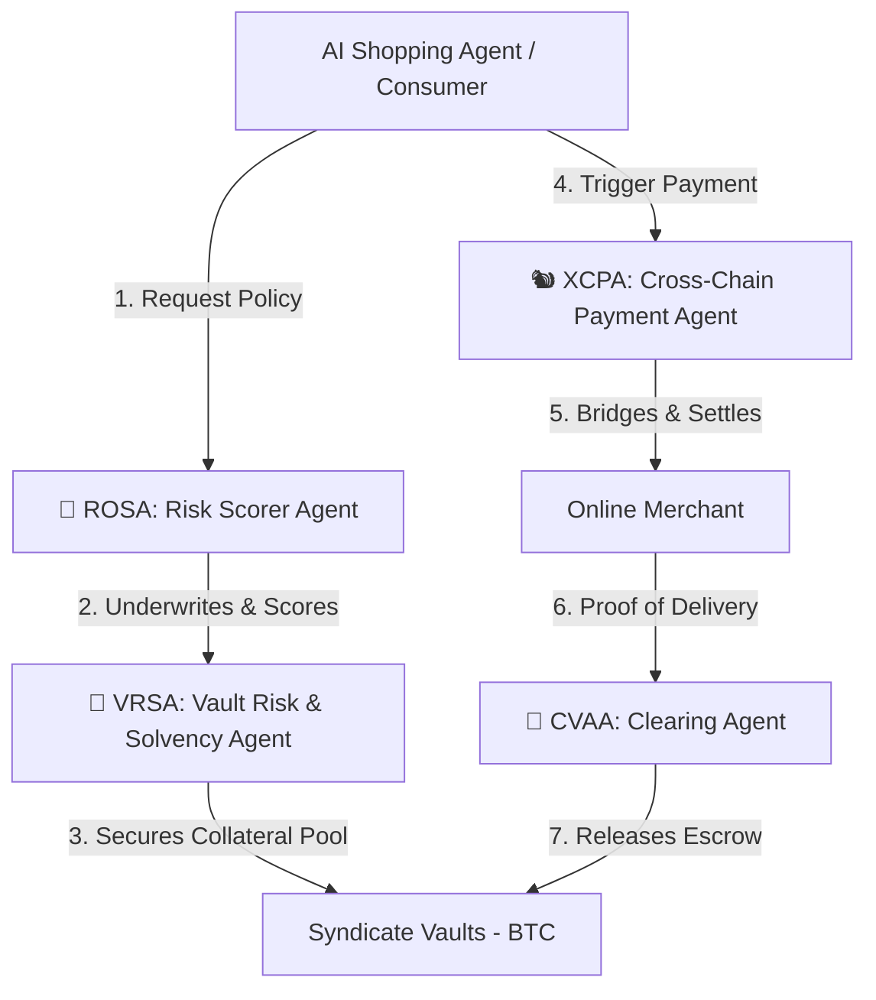

# 🛡️ Novae Rog

### Autonomous Multi-Agent Risk & Payment Underwriting Protocol on GOAT Network

Novae Rog is a decentralized, Bitcoin-secured risk management and payment orchestration protocol. By leveraging the high-throughput capabilities of the **GOAT Network L2**, the standard **ERC-8004 Agent Identity Registry**, and the **x402 Micropayment Protocol**, Novae Rog orchestrates a decentralized Forest Council of four specialized, air-gapped AI agents to programmatically underwrite on-chain transactions and secure the machine-to-machine economy.

---

## 📜 Genesis & Core Philosophy

> *"Novae Rog was born from my years spent in the trenches of decentralized finance and on-chain trading. Having been deeply passionate about cryptocurrency, Web3, and blockchain technology for a significant portion of my life, I’ve had the privilege of experiencing the entire spectrum—from classic foundational assets like Ripple and Cardano to the modern, high-velocity era of hyper-trading, cross-chain yield farming, and airdrops."*

This project represents a personal and philosophical conflict. While I love the vibrant energy of the space, I have long wanted to build something that legitimizes Web3 beyond sheer speculation. I wanted to help establish actual utility vehicles for long-term wealth creation and retention—mirroring the robust, store-of-value principles pioneered by Bitcoin, which the broader crypto ecosystem has struggled to replicate despite endless iterations.

The spark for Novae Rog came from a close friend. Taking that initial concept, I spent weeks refining the design and mapping out the user experience. Because I live and breathe this space, I designed this platform for myself and the millions of users like me who prefer transacting natively on-chain. 

Building this system alongside an AI partner was an incredibly rewarding experience, full of the emotional highs and lows that define intense creative sprints. Although we did not complete the full implementation in time for the hackathon deadline, the journey only strengthened my conviction in Novae Rog. While many projects fell back on standard, superficial "on-chain payment" additions—essentially repackaging speculative mechanisms as "utility"—Novae Rog aims for a fundamentally higher standard. 

The core objective of Novae Rog is to bridge the gap between different market participants. By aligning the incentives of active speculators, yield-seeking passive investors, and casual retail consumers, we create a secure, self-reinforcing ecosystem where everyone benefits. Speculators get protection, stakers earn sustainable yield from real underwriting activities, and retail users participate in a secure on-chain commerce experience without even needing to understand the underlying complexity.

---

## 🌲 The Multi-Agent Forest Council Architecture

At the heart of Novae Rog is a strict, air-gapped division of labor among four specialized AI agents. This "Forest Council" ensures that risk scoring, cross-chain execution, vault solvency, and escrow clearing are handled independently, preventing single points of failure.

### The Council Members:
1. **🦉 ROSA (Risk Scorer Agent):** Analyzes merchant wallets, historical transaction velocity, on-chain identity records, and liquidity depth to calculate real-time trust metrics and policy premiums.
2. **🐿️ XCPA (Cross-Chain Payment Agent):** Handles gas-optimized, cross-chain transaction routing (GOAT, Ethereum, BSC, Polygon, Arbitrum) utilizing the x402 protocol.
3. **🦝 CVAA (Clearing & Vault Activation Agent):** Programmatically monitors physical/digital shipment tracking APIs, matches claims, and manages the release of 30-day consumer protection escrows.
4. **🐻 VRSA (Vault Risk & Solvency Agent):** Continuously monitors the health, liquidity ratios, and collateral backing of the Bitcoin Syndicate pools to protect liquidity providers.

---

## ⚡ Core Technical Features

* **x402 Micropayment Integration:** Facilitates automated HTTP 402 Payment Required flows, allowing AI-to-AI micro-insurance premium settlement without user friction.
* **Bitcoin Syndicate Pools:** Yield-seeking stakers deposit BTC on the GOAT Network to underwrite transaction risk, earning yield from real-world policy premiums.
* **E-Commerce Consumer Escrows:** Implements programmatic 30-day return escrows and T+0 dynamic settlement pathways for verified, high-trust merchants.
* **ERC-8004 Agent Identity:** Fully compliant agent registration on GOAT Network mainnet for verifiable, secure agent-to-agent discovery.

---

## 🛠️ Repository Contents & Tools

This repository houses the design specifications, protocol blueprints, and helper utilities built during our development sprint:
* **[base-concept.md](file:///C:/Users/andyf/Documents/GitHub/Novae-Rog/base-concept.md):** The high-level product design, monetization strategy, and core mechanics.
* **[multi-agent-architecture.md](file:///C:/Users/andyf/Documents/GitHub/Novae-Rog/multi-agent-architecture.md):** Granular communication schemas, APIs, and state machine layouts for the 4-agent Council.
* **[system-spec.md](file:///C:/Users/andyf/Documents/GitHub/Novae-Rog/system-spec.md):** Smart contract interfaces, technical math equations for risk calculation, and escrow parameters.
* **[register-mainnet.html](file:///C:/Users/andyf/Documents/GitHub/Novae-Rog/register-mainnet.html):** A standalone, local dApp portal designed to connect **Rabby Wallet** and easily register or update ERC-8004 Agent metadata directly on the **GOAT Network Mainnet**.

---

## 🔮 The Future of Novae Rog

Although our hackathon journey has concluded, the vision for Novae Rog is open for anyone who wants to turn this into a production-grade system. As AI agents increasingly participate in the global economy, the need for decentralized, secure, and trust-minimized transactional insurance will be a multi-billion dollar frontier. 

If you are a developer, designer, or investor interested in bringing this multi-agent oracle network to life, please feel free to fork, explore, and build upon this repository. 

*Let's legitimize on-chain commerce together.*
