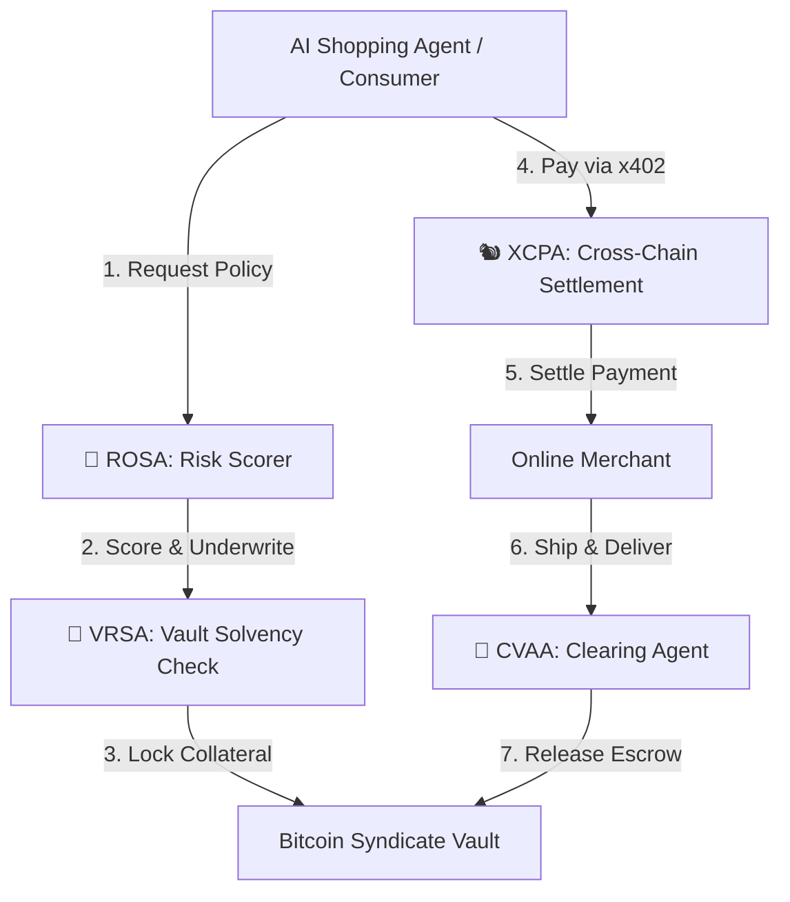

# 🛡️ Novae Rog

An autonomous multi-agent risk and payment underwriting protocol built on the GOAT Network. Novae Rog coordinates an air-gapped "Forest Council" of four specialized AI agents to programmatically underwrite on-chain transactions and secure decentralized commerce.

---

## 📜 Why I Built This (The Real Story)

Novae Rog is inspired directly by my own experience trading on-chain. It's inspired by years of my life as someone who has been very passionate and avid about cryptocurrency, Web3, and blockchain technology. I've had the blessing to experience both the old classics—the original "shitcoins" like XRP and Cardano (ADA)—as well as the new form of crypto: the hyper-gambling, trading on multiple chains at once, the airdrops, and everything people love and hate about this space. 

I was incredibly inspired to build Novae Rog, but also deeply conflicted. I want so badly to build something that legitimizes crypto for something more than speculative purposes. I want to help create actual vehicles for wealth creation, value generation, and wealth retention—like what Bitcoin accomplishes, but what the rest of crypto simply can't seem to repeat no matter how many iterations, attempts, and millions we spend trying.

The initial idea for Novae Rog actually came from a good friend. From there, I took it and really built upon it to conceptualize the entire system. One thing I absolutely loved about this process was spending a lot of time building my concept, my design, and truly understanding who the customer was—because I *am* the customer. I know tons of people just like me who prefer to transact on-chain, and I wanted to offer them something real.

Building this alongside an AI agent was an incredible experience. I had a lot of fun, and I went through a lot of emotional highs and lows. In the end, we completely lost the hackathon because we weren't able to finish in time. I took it to heart and felt very hurt—not just because we lost, but because I genuinely found the ideas of my peers to be inferior. I don't mean that in some cocky way; I mean it genuinely. 

A lot of what I saw at the competition was just "been there, done that." People just added a standard on-chain payment button to a project and called it a day. Come on, bro—that's a fucking shitcoin. 

Novae Rog is different. The whole concept is to provide a form of wealth creation that encourages the speculator to participate, the investor to participate, and the casual retail person to participate (unbeknownst to them), in a way that actually benefits all parties.

---

## 🌲 How it Works: The Multi-Agent Forest Council

Instead of a single bot or a simple payment button, Novae Rog divides labor among four air-gapped AI agents to score risk, handle transactions, and secure the vault.

### The 4 Agents:
* **🦉 ROSA (Risk Scorer Agent):** Digs through merchant wallets, transaction speed, identity, and liquidity to calculate dynamic trust scores and insurance premiums.
* **🐿️ XCPA (Cross-Chain Payment Agent):** Routes payments across chains (GOAT, Ethereum, BSC, Polygon, Arbitrum) using the x402 protocol.
* **🦝 CVAA (Clearing Agent):** Monitors real-world shipping APIs to match claims and handle the 30-day consumer protection escrows.
* **🐻 VRSA (Vault Risk Agent):** Monitors the liquidity ratios of the BTC Syndicate pools so stakers are protected.

---

## 🛠️ What's in this Repo

* **[base-concept.md](file:///C:/Users/andyf/Documents/GitHub/Novae-Rog/base-concept.md):** The high-level vision, monetization model, and core concept.
* **[multi-agent-architecture.md](file:///C:/Users/andyf/Documents/GitHub/Novae-Rog/multi-agent-architecture.md):** The communications, APIs, and state machine details for the 4-agent Council.
* **[system-spec.md](file:///C:/Users/andyf/Documents/GitHub/Novae-Rog/system-spec.md):** The math formulas, smart contract specs, and vault setups.
* **[register-mainnet.html](file:///C:/Users/andyf/Documents/GitHub/Novae-Rog/register-mainnet.html):** A clean, local page you can run in Brave/Chrome to connect **Rabby Wallet** and register your ERC-8004 Agent on the **GOAT Network Mainnet** in one click.

---

## 🔮 Build It

I don't have the time to build this out fully right now, but a multi-agent setup is the optimal way to make this work. If you're a developer who wants to build something that actually legitimizes decentralized commerce instead of just launching another wrapper, fork this repo and start building. 
